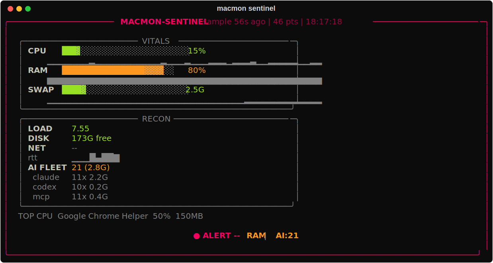
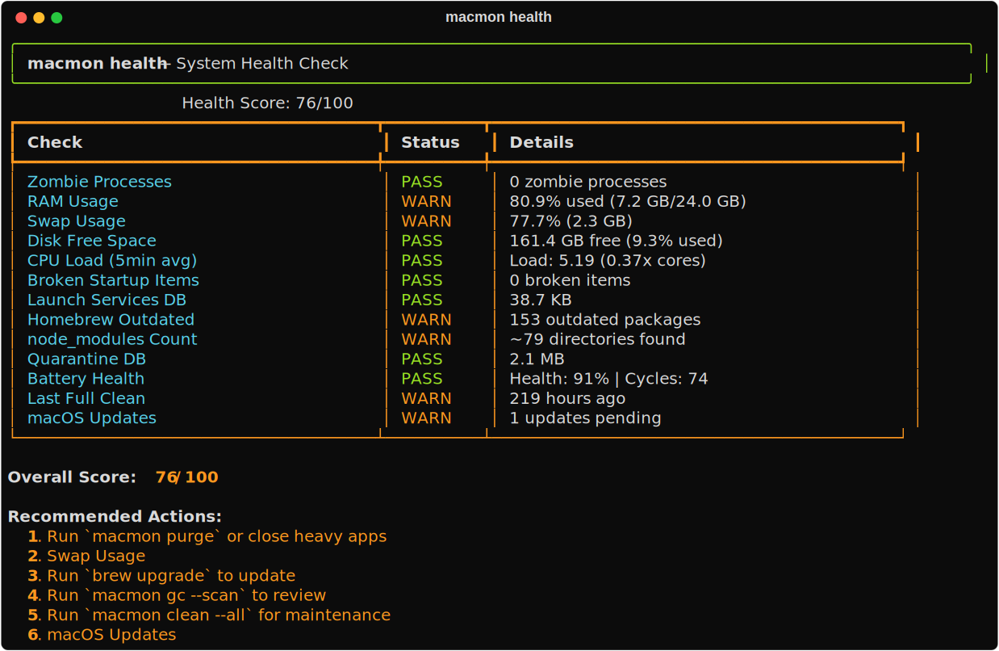
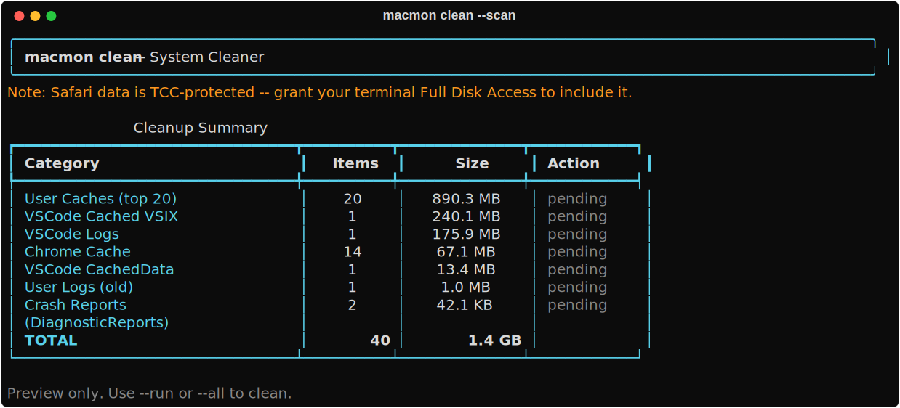
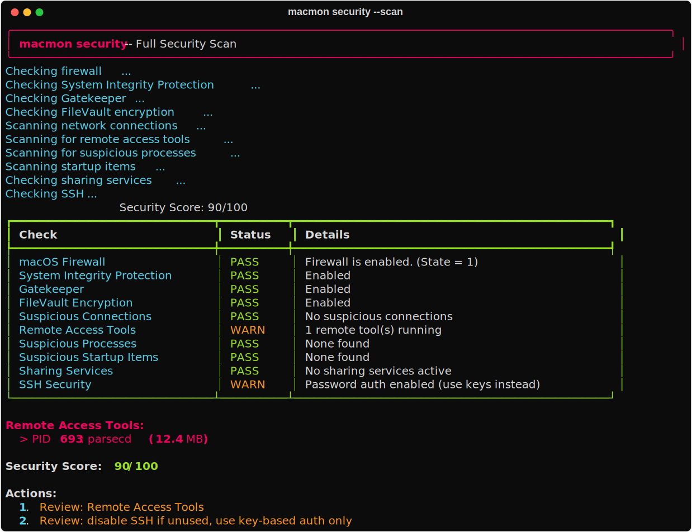
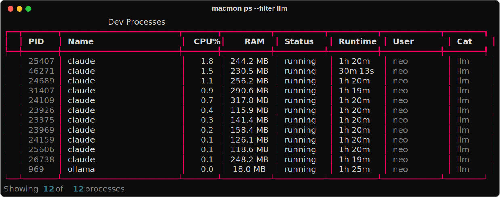

<p align="center">
  
</p>

<h1 align="center">macmon — the free, open-source Mac cleaner &amp; system monitor for developers</h1>

<p align="center">
  <strong>A terminal-native macOS system monitor, cleaner and optimizer — a free, private, open-source CCleaner alternative built for developers. 100% local, zero telemetry.</strong>
</p>

<p align="center">
  <a href="https://github.com/SoCloseSociety/macmon/actions/workflows/ci.yml"></a>
  <a href="https://github.com/SoCloseSociety/macmon/stargazers"></a>
  
  
  
  
  
  
  
  
</p>

<p align="center">
  <a href="#installation">Install</a> &bull;
  <a href="#quick-start">Quick Start</a> &bull;
  <a href="#screenshots">Screenshots</a> &bull;
  <a href="#macmon-sentinel">Sentinel</a> &bull;
  <a href="#features">Features</a> &bull;
  <a href="#command-reference">Commands</a> &bull;
  <a href="https://soclose.co">SoClose</a>
</p>

<p align="center">
  
</p>

---

## What is macmon?

**macmon** is a **free, open-source Mac system monitor and cleaner** that runs entirely in your terminal. Think **CCleaner Pro + Activity Monitor + Security Scanner + Docker Manager**, reimagined as one fast CLI with a live TUI dashboard — purpose-built for developers who live in the shell.

If you have ever searched for *"how to clean my Mac"*, *"free CCleaner alternative for macOS"*, *"free up disk space on Mac"*, *"why is my Mac slow"*, or *"macOS system monitor CLI"* — this is the tool, and it never phones home.

**30 commands** · **18 modules** · **Live dashboard** · **MACMON-SENTINEL always-on watchdog** · **Keyboard shortcuts that execute real actions** · **Autopilot daemon** · **Thermal management** · **Security &amp; malware scanner** · **Docker manager** · **100% local, zero telemetry**

### Why developers pick macmon

- **Free &amp; open source (MIT)** — no license, no account, no upsell, no cloud.
- **Private by design** — everything runs locally; nothing is uploaded, ever.
- **Developer-first cleanup** — reclaims `node_modules`, stale venvs, Docker cache, Xcode/DerivedData, npm/pip/brew caches with safety guards.
- **Safe deletes** — moves to Trash by default and never silently escalates to permanent deletion.
- **One binary of a habit** — monitor, clean, secure and keep your Mac fast from a single CLI.

---

## Platform support

macmon is **macOS-first** (that is where every feature works), with a
**cross-platform core** so the portable tools also run on Windows and Linux.
On other platforms, macOS-only commands degrade gracefully with a clear
"requires macOS" message instead of crashing.

This is not a claim -- it is enforced. [CI](.github/workflows/ci.yml) runs on
**macOS, Ubuntu and Windows** (Python 3.11 and 3.13) on every push: it imports
all 18 modules, smoke-tests the portable commands, and asserts that every
macOS-only command exits cleanly with a "requires macOS" notice off-mac.

| Feature | macOS | Windows | Linux |
|---|:---:|:---:|:---:|
| `ps` / `kill` / `suspend` / `nice` (processes) | ✅ | ✅ | ✅ |
| `disk` / `bigfiles` / `dupes` | ✅ | ✅ | ✅ |
| `clean` (temp / cache / logs / dev caches) <sup>1</sup> | ✅ | ✅ | ✅ |
| `gc` (node_modules, venvs, docker, caches) <sup>2</sup> | ✅ | ✅ | ✅ |
| `network` / `flush-dns` | ✅ | ✅ | ✅ |
| `docker` management | ✅ | ✅ | ✅ |
| `health` score | ✅ | ✅ (core checks) | ✅ (core checks) |
| **`sentinel`** monitor + auto-remediation | ✅ | ✅ (schtasks) | ✅ (cron) |
| Live `dashboard` (TUI) | ✅ | ✅ | ✅ |
| `security` (pf, SIP, FileVault, Gatekeeper) | ✅ | -- | -- |
| `privacy` / `startup` / `uninstall` / `auto` / `focus` | ✅ | -- | -- |

<sup>1</sup> Core paths only (temp, caches, logs, dev caches) route through the
cross-platform layer. `clean --browsers` still uses macOS browser-profile paths
(`~/Library/...`), so it finds nothing on Windows/Linux today.

<sup>2</sup> Core scanning (node_modules, venvs, `__pycache__`, Docker, npm /
pnpm / yarn / bun) is cross-platform. The pip cache path is macOS-only today, so
that one category comes back empty elsewhere.

On Windows/Linux install by cloning + `pip install -r requirements.txt`, then
`python macmon.py`. The macOS `install.sh` sets up the `macmon` shortcut on
macOS/Linux.

---

## Screenshots

<table>
<tr>
<td width="50%" valign="top" align="center">
<strong>System health, scored /100</strong><br>

</td>
<td width="50%" valign="top" align="center">
<strong>One-pass junk &amp; cache cleaner</strong><br>

</td>
</tr>
<tr>
<td width="50%" valign="top" align="center">
<strong>Security &amp; malware audit</strong><br>

</td>
<td width="50%" valign="top" align="center">
<strong>Categorized process monitor</strong><br>

</td>
</tr>
</table>

> Above: the **MACMON-SENTINEL** tactical console (top of page). All output is real, rendered live — no mockups.

---

## Features

<table>
<tr>
<td width="50%" valign="top">

### Live Dashboard
Full-screen TUI with real-time monitoring:
- CPU per-core with sparkline history
- RAM / Swap / Wired / Active breakdown
- Disk I/O rates & Network sparklines
- Thermal monitoring (CPU temp, fan RPM, throttle detection)
- Security score & Docker containers live panels
- Process list with category icons
- Alerts & smart suggestions

</td>
<td width="50%" valign="top">

### Interactive Keyboard Shortcuts
Execute **real actions** directly from the dashboard:

| Key | Action |
|-----|--------|
| `S` | Sweep: kill zombies, orphans, stale locks |
| `P` | Purge inactive RAM |
| `C` | Full system clean (junk, caches, browsers) |
| `G` | Dev garbage collector (node_modules, venvs) |
| `H` | Health check + auto-fix |
| `K` | Full security audit |
| `D` | Docker overview |
| `F` | Focus mode (quit apps, DND) |
| `1-9` | Kill process #N from the list |
| `Q` | Quit |

</td>
</tr>
</table>

<table>
<tr>
<td width="33%" valign="top">

### System Cleaner
- System junk (temp, logs, crash reports)
- 8 browsers (Chrome, Safari, Firefox, Arc, Brave, Opera, Edge, Chromium)
- App caches (Xcode, VSCode, Cursor, Slack, Spotify, JetBrains...)
- Clipboard & recent items clear
- Schedule via launchd

</td>
<td width="33%" valign="top">

### Dev Garbage Collector
- npm / pnpm / yarn / bun caches
- Stale `node_modules` and `venvs`
- `__pycache__`, `.DS_Store`
- Homebrew, Docker, Xcode DerivedData
- iOS Simulators, Go, Cargo

</td>
<td width="33%" valign="top">

### Security Scanner
- Security score /100
- Firewall, SIP, Gatekeeper, FileVault
- Suspicious port detection (Metasploit, IRC, backdoors)
- Remote tool detection (TeamViewer, AnyDesk, VNC)
- Malware indicators & crypto miners
- IP blocking via pf & process quarantine

</td>
</tr>
<tr>
<td width="33%" valign="top">

### Process Manager
- Category detection (IDE, browser, Docker, Node, Python...)
- Kill / suspend / resume / renice / quit / restart
- Zombie & orphan sweep
- Port manager with lsof fallback

</td>
<td width="33%" valign="top">

### Docker Manager
- Container / image / volume / network listing
- Full prune, stop-all, restart, logs, live stats
- Compose project listing
- Security scan (privileged, host network, root, public ports)

</td>
<td width="33%" valign="top">

### Autopilot Daemon
Background rules engine:
- RAM critical → purge
- CPU runaway → renice
- Thermal management → auto-throttle
- Security monitoring → alerts
- Browser RAM hog → notification
- Low disk & weekly clean reminders

</td>
</tr>
<tr>
<td width="33%" valign="top">

### Privacy Cleaner
- Recent items, Finder, QuickLook cache
- Shell history (zsh/bash/fish)
- REPL history (Python/Node/SQLite/IRB)
- Spotlight, SSH known_hosts, Siri

</td>
<td width="33%" valign="top">

### Health Check
- 13+ system checks with score /100
- Auto-fix for safe issues
- Report saving & history

</td>
<td width="33%" valign="top">

### More Tools
- **Startup Manager** — LaunchAgents, daemons, cron
- **App Uninstaller** — full leftover detection
- **Duplicate Finder** — 3-phase xxhash + SHA-256
- **Disk Analyzer** — big files, categorization
- **Focus Mode** — quit apps, DND, restore

</td>
</tr>
</table>

---

## Installation

```bash
git clone https://github.com/SoCloseSociety/macmon.git
cd macmon
bash install.sh
```

This will:
1. Check Python 3.11+
2. Create a venv at `~/.macmon/venv`
3. Install dependencies (`rich`, `psutil`, `typer`, `send2trash`, `xxhash`)
4. Create `/usr/local/bin/macmon` wrapper
5. Initialize config at `~/.macmon/config.toml`

### Build DMG (optional)

```bash
bash build_dmg.sh
open dist/macmon.dmg
```

---

## Quick Start

```bash
# Launch the live dashboard
macmon

# Full system clean
macmon clean --all -y

# Dev garbage collector
macmon gc --all -y

# Security audit
macmon security

# Health check + auto-fix
macmon health --fix

# Kill zombies & orphans
macmon sweep -y

# Purge RAM
macmon purge

# Start autopilot daemon
macmon auto --start

# Focus mode
macmon focus

# All commands
macmon --help
```

---

## Command Reference

| Command | Description |
|---------|-------------|
| `macmon` | Live dashboard |
| `macmon ps` | Process list with categories |
| `macmon kill <target>` | Kill process |
| `macmon suspend / resume <target>` | Suspend / resume process |
| `macmon nice <target> <val>` | Renice process |
| `macmon quit / restart <app>` | Graceful quit / restart app |
| `macmon sweep` | Kill zombies, orphans, stale locks |
| `macmon ports` | Port manager |
| `macmon clean --scan` | Preview cleanable junk |
| `macmon clean --all -y` | Full system clean |
| `macmon clean --browsers` | Browser cleaner |
| `macmon gc --scan` | Preview dev garbage |
| `macmon gc --all -y` | Full dev GC |
| `macmon privacy --scan` | Preview privacy traces |
| `macmon privacy --full -y` | Wipe all traces |
| `macmon health` | Health check /100 |
| `macmon health --fix` | Auto-fix safe issues |
| `macmon startup --list` | List startup items |
| `macmon startup --audit` | Audit suspicious items |
| `macmon uninstall <app>` | Uninstall + leftover cleanup |
| `macmon dupes <path>` | Find duplicate files |
| `macmon bigfiles` | Find large files |
| `macmon disk` | Disk usage analyzer |
| `macmon network` | Network connections |
| `macmon flush-dns` | Flush DNS cache |
| `macmon security` | Security audit /100 |
| `macmon security --block-ip <ip>` | Block IP via pf firewall |
| `macmon security --quarantine <proc>` | Kill + block process |
| `macmon docker` | Docker overview |
| `macmon docker --prune -y` | Docker full cleanup |
| `macmon docker --scan` | Docker security audit |
| `macmon auto --start / --stop` | Start / stop autopilot daemon |
| `macmon focus / restore` | Focus mode on / off |
| `macmon purge` | Purge inactive RAM |
| `macmon report` | Session report |
| `macmon config --show / --edit` | View / edit config |
| `macmon sentinel --install` | Arm the always-on light monitor |
| `macmon sentinel` | Tactical console snapshot |
| `macmon sentinel --watch` | Live tactical console |
| `macmon sentinel --force-clean` | Manual override: scan then clean |
| `macmon sentinel --test-notify` | Test notification (shows the macmon icon) |
| `macmon sentinel --enable-auto` | Enable safe auto-remediation (unload idle ollama models + RAM purge) |
| `macmon sentinel --enable-auto --aggressive` | Also auto-close idle AI sessions |
| `macmon sentinel --disable-auto` | Disable all auto-remediation (back to notify-only) |
| `macmon sentinel --trim` | Close idle AI sessions now |
| `macmon sentinel --unload-ollama` | Unload idle ollama models now (they reload on demand) |
| `macmon sentinel --setup-purge` | Grant passwordless `purge` via sudoers so auto-purge runs unattended |

---

## MACMON-SENTINEL (always-on monitor)

An ultra-light watchdog that keeps the Mac operational without you watching it.

- **Near-zero cost:** a single-shot sampler fires every 60s via a LaunchAgent,
  measures in ~0.5s, appends one compact JSON line, then exits. No resident
  process between samples (~0.1% average CPU, ~20 MB peak per sample).
- **Precise:** tracks CPU, RAM, swap, load, disk, network RTT, the top CPU
  process, and the AI-agent fleet (Claude Code / codex / MCP counts + RSS) so
  forgotten sessions are surfaced, not rediscovered in a crisis.
- **Hidden RAM hogs, surfaced:** it also tracks the two big ones nothing else
  shows you -- **loaded ollama models** (`ollama ps`, multi-GB and easy to
  forget) and the **Docker/Colima VM footprint**. The VM is *notify-only*: the
  Sentinel warns above `vm_gb` and never stops it on its own.
- **Auto-interaction:** threshold alerts fire native macOS notifications
  (swap high, memory pressure, runaway process, network saturated, low disk,
  AI fleet too large), each with a cooldown.
- **Auto-remediation (safe escalation):** nothing is automatic until you opt in.
  Remediation only fires when memory pressure is genuinely critical (RAM above
  `ram_critical` **and** swap above `swap_critical_gb`), and the Sentinel always
  notifies what it did:
  - **Level 1a -- `auto_unload_ollama`** (non-destructive): unloads **idle**
    ollama models when RAM is critical and they hold at least `ollama_gb`. Never
    touches a model mid-inference (a busy runner is detected and skipped), and
    models reload automatically on the next request. **Turned ON by
    `--enable-auto`.**
  - **Level 1b -- `auto_purge`** (non-destructive, macOS only): frees inactive
    RAM via `purge`. **Turned ON by `--enable-auto`.**
  - **Level 2 -- `auto_trim_fleet`** (opt-in): closes *idle* AI coding sessions
    (Claude Code) beyond a configurable minimum (`fleet_keep`), protecting the
    most recently active ones so the session you are using is never touched. A
    session must be idle for `idle_samples` samples (~10 min) first, and sessions
    are resumable (`--resume`). **Requires `macmon sentinel --enable-auto --aggressive`.**
  - Turn everything back off with `macmon sentinel --disable-auto` (notify-only).
  - Manual levers any time: `macmon sentinel --trim` closes idle sessions now,
    `macmon sentinel --unload-ollama` unloads idle ollama models now.

> **Heads-up:** `--enable-auto` enables levels 1a **and** 1b. That means once RAM
> is critical, macmon may unload your loaded ollama models without asking. It is
> non-destructive (they reload on demand, and never mid-inference), but if you
> want notifications only, do not run `--enable-auto`.

### Passwordless purge (`--setup-purge`)

`purge` requires root, so unattended `auto_purge` needs sudo without a password
prompt. `macmon sentinel --setup-purge` sets that up explicitly, and only that:

- It writes **`/etc/sudoers.d/macmon-purge`** containing exactly one line:
  `<your-user> ALL=(root) NOPASSWD: /usr/sbin/purge`
- The snippet is validated with `visudo -c` **before** being installed (a
  malformed sudoers file would break `sudo` system-wide), then installed `0440`.
- The grant is **scoped to that single binary** -- `/usr/sbin/purge` and nothing
  else. It is not blanket passwordless sudo.
- Without it, `auto_purge` is simply skipped and notifications still fire. It is
  optional.
- **Revoke at any time:** `sudo rm /etc/sudoers.d/macmon-purge`
- **Manual override:** force levers when you must push the system --
  `--force-purge`, `--force-clean`, `--force-focus`, `--pause` / `--resume`.
- **Branded notifications:** alerts pop up carrying the macmon icon (not the
  generic Script Editor icon) via a tiny bundled notifier app. Try it with
  `macmon sentinel --test-notify`.

```bash
macmon sentinel --install     # arm it (LaunchAgent, 60s sampler)
macmon sentinel               # tactical snapshot with gauges + sparklines
macmon sentinel --watch       # live console
macmon sentinel --status      # agent + config status
macmon sentinel --log         # recent alerts
```

### Sentinel config

Config lives in `~/.macmon/sentinel.conf` (JSON). Any key you omit falls back to
the default below.

| Key | Default | Meaning |
|---|---|---|
| `swap_used_gb` | `6.0` | Alert when swap usage exceeds this many GB |
| `ram_pct` | `92.0` | Alert when RAM usage exceeds this percentage |
| `proc_cpu` | `95.0` | Alert when a single process exceeds this CPU% (runaway) |
| `rtt_ms` | `400.0` | Alert when network round-trip time exceeds this |
| `disk_free_gb` | `15.0` | Alert when free disk space drops below this |
| `ai_fleet` | `12` | Alert when the AI-agent fleet exceeds this many processes |
| `ping_every` | `5` | Ping only every Nth sample (spares a metered link) |
| `ollama_gb` | `2.0` | Warn when idle ollama models hold more than this |
| `vm_gb` | `4.0` | Warn when a Docker/Colima VM holds more than this (notify-only) |
| `auto_purge` | `false` | Level 1b: purge inactive RAM when critical (macOS only) |
| `auto_unload_ollama` | `false` | Level 1a: unload idle ollama models when critical |
| `auto_trim_fleet` | `false` | Level 2: close idle AI sessions when critical |
| `fleet_keep` | `4` | Always keep at least this many AI sessions alive |
| `ram_critical` | `90.0` | Remediation triggers above this RAM% ... |
| `swap_critical_gb` | `8.0` | ... **and** above this swap usage, never on one alone |
| `idle_samples` | `10` | A session must be idle this many samples (~10 min) before trimming |

---

## Architecture

```
macmon.py                CLI router (typer, 30 commands)
modules/
  dashboard.py           Live TUI (rich) — 12 panels, keyboard shortcuts
  sentinel.py            MACMON-SENTINEL: 60s sampler, alerts, auto-remediation
  processes.py           Process manager, sweep, ports
  cleaner.py             System cleaner (junk, browsers, apps)
  gc.py                  Dev garbage collector
  security.py            Security scanner & IP blocking
  docker_mgr.py          Docker container/image/volume management
  autopilot.py           Daemon, thermal rules, security rules, focus mode
  health.py              Health check /100 & reports
  privacy.py             Privacy traces wiper
  startup.py             Startup/login items manager
  uninstaller.py         App uninstaller with leftover detection
  duplicates.py          Duplicate file finder (xxhash + SHA-256)
  disk.py                Disk analyzer & big file finder
  network.py             Network monitor
  config.py              TOML config manager
  platform_compat.py     Cross-platform layer (macOS / Windows / Linux paths, require_os)
  utils.py               Shared utilities, SQLite DB, logging
```

## Tech Stack

<p>
  
  
  
  
  
  
</p>

## Config

Config lives at `~/.macmon/config.toml`:

```bash
macmon config --edit
```

Key sections: `dashboard`, `thresholds`, `cleaner`, `privacy`, `gc`, `focus_mode`, `notifications`, `autopilot`.

## License

MIT — see [LICENSE](LICENSE). Free forever, for any use.

## FAQ

**Is macmon really free?** Yes — MIT licensed, no account, no telemetry, no paid tier.

**Does it send my data anywhere?** No. Everything runs locally on your Mac. There is zero network telemetry.

**Is it a CCleaner alternative for Mac?** Yes — it covers the same ground (caches, logs, temp, browser data, privacy traces) plus developer-specific cleanup (`node_modules`, venvs, Docker, Xcode) and safe Trash-first deletes.

**Will it delete something important?** Deletes move to the Trash by default and never silently escalate to permanent removal. Destructive categories are opt-in.

**Which macOS versions?** macOS 12 (Monterey) and newer, on Apple Silicon and Intel. Python 3.11+.

---

<sub><strong>Keywords:</strong> mac cleaner · macOS system monitor · clean my Mac · free CCleaner alternative macOS · free up disk space Mac · why is my Mac slow · macOS terminal system cleaner · developer Mac tools · node_modules cleaner · Docker disk cleanup Mac · macOS privacy cleaner · macOS malware scanner CLI · Activity Monitor alternative · Mac optimizer open source · Python Typer Rich TUI · zero telemetry mac utility</sub>

---

<p align="center">
  <sub>Built with purpose by <strong><a href="https://soclose.co">SoClose</a></strong> — Digital Innovation Through Automation & AI</sub>
</p>
